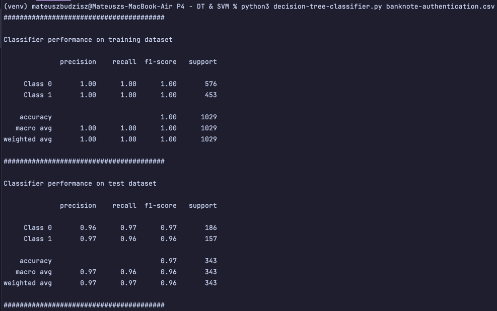
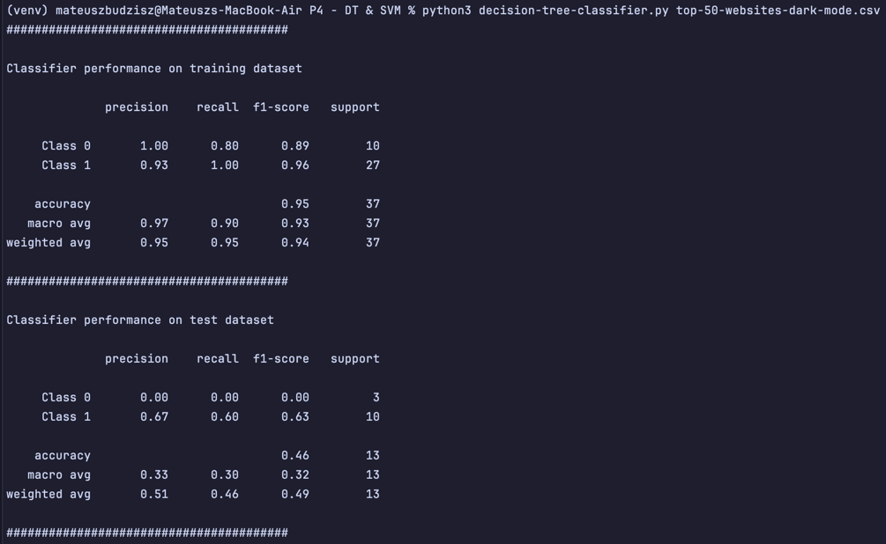
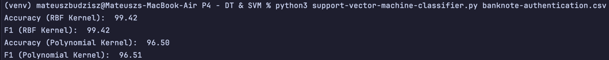
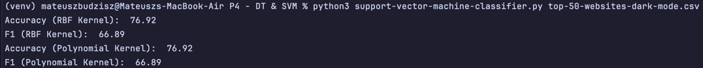
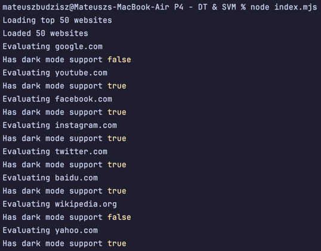

# Decision Trees & Support Vector Machine classifications

## Overview
This project provides example of DT & SVM usage implemented in Python as well as basic data gathering implemented in JavaScript.

## Dependencies
Requirements:
- `python 3.9+`
- `node 21.0.0+`

Ensure that you have installed the necessary libraries by running the following commands:
- `pip install scikit-fuzzy`
- `pip install numpy`
- `npm i`

## Running
### Decision Tree classifier
`python3 decision-tree-classifier.py banknote-authentication.csv` for banknote dataset

`python3 decision-tree-classifier.py top-50-websites-dark-mode.csv` for custom dataset

### Support Vector Machine classifier
`python3 support-vector-machine-classifier.py banknote-authentication.csv` for banknote dataset

`python3 support-vector-machine-classifier.py top-50-websites-dark-mode.csv` for custom dataset

### Custom dataset WebScrapper
`node main.mjs` to produce `top-50-websites-dark-mode.csv` (*file is included in repo*)

