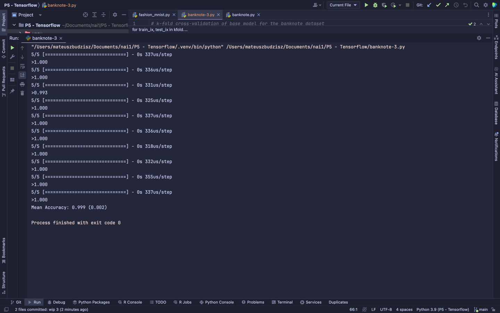
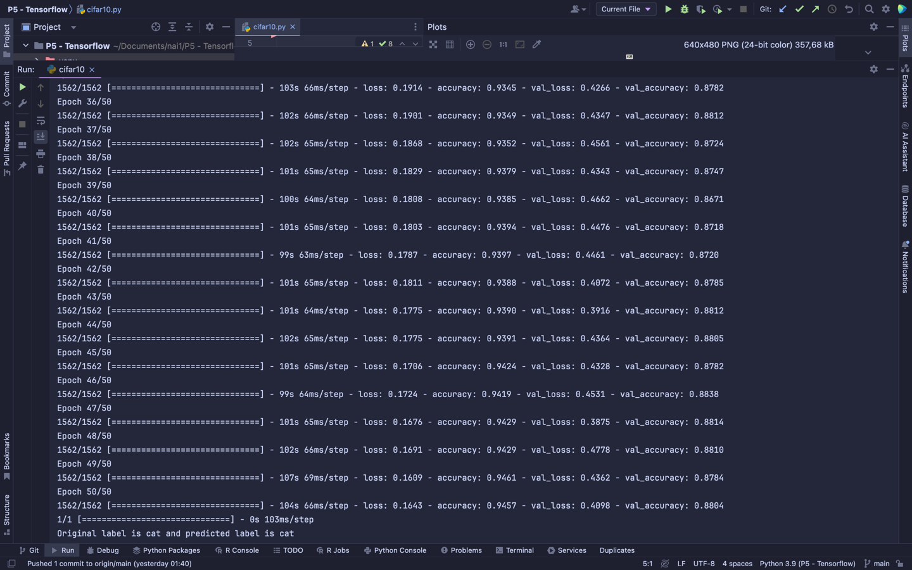
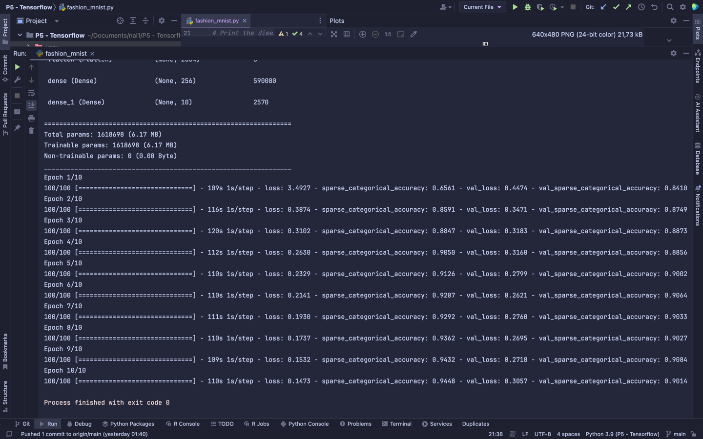
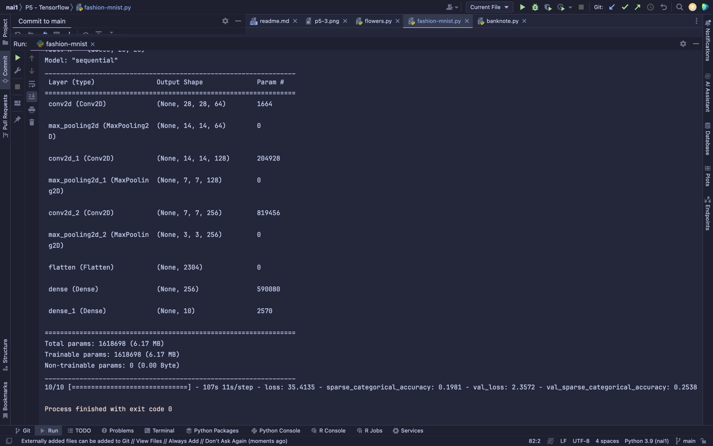
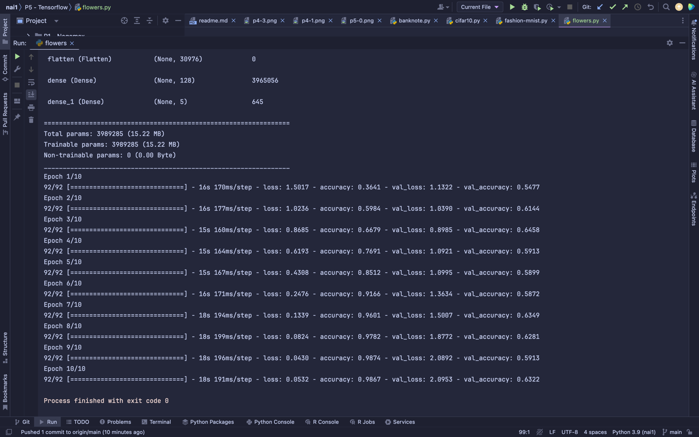

# Machine learning using Tensorflow
## Dependencies
Requirements:
- `python 3.9+`

Ensure that you have installed the necessary libraries by running the following commands:
- `pip install scikit-fuzzy`
- `pip install numpy`
- `pip install pandas`
- `pip install scikit-learn`
- `pip install tensorflow`
- `pip install matplotlib`
- `pip install keras`
- `pip install urllib3==1.26.15` Only if you see ssl errors

## Overview
1. **Banknote rigged or authentic** \
   Run with `python banknote.py` \
   Compared to [Decision Tree and Vector Support Machine](../P4%20-%20DT%20&%20SVM/readme.md), ML approach has significantly better accuracy than DT and slightly better than SVM with RBF kernel. \
   
   Accuracy: 0.99

2. **Cifar 10 - animal classification based on image** \
   Run with `python cifar10.py` \
   
   Accuracy: 0.95

3. **fashion mnist - clothes classification based on image** \
   Run with `python fashion-mnist.py` \
    \
   Accuracy: 0.90 \
   Epochs = 1 & steps per epoch = 10: \
    \
   Accuracy with 10 times smaller model: 0.20

4. **Google flower photos - flowers classification based on image** \
   Run with `python flowers.py` \
    \
   Accuracy: 0.99
